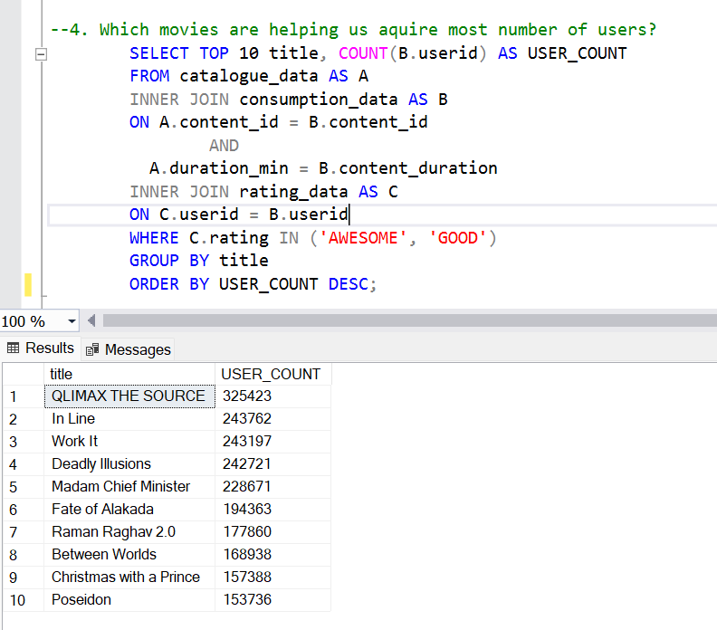
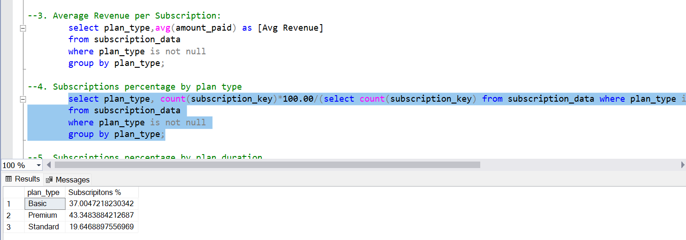
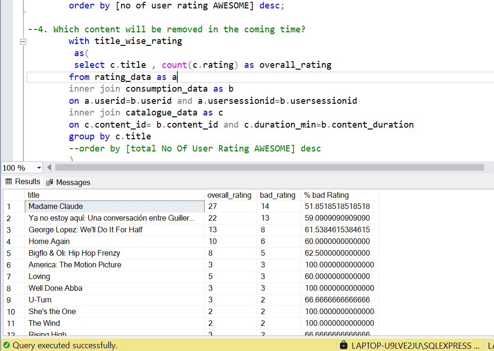
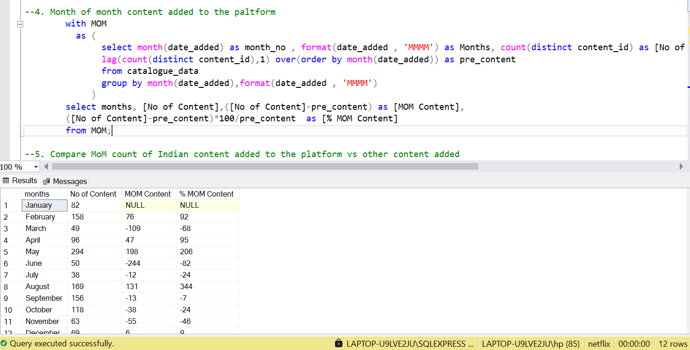

# 📊 Netflix Case Study - Data Analysis with SQL

This project presents a comprehensive analysis of a fictional Netflix dataset using advanced SQL queries. The goal is to uncover actionable business insights related to content performance, user engagement, and subscription trends.

---

## 📁 Project Structure

```
📦 Netflix-Case-Study/
├── 📄 Netflix case study solution.sql # Main SQL script with all analysis queries
├── 📄 subscription_data.csv # Subscription data including plan and revenue details
├── 📄 catalogue_data.csv # Metadata of content available on the platform
├── 📄 consumption_data.zip
|          └── consumption_data.csv # User behavior and viewing activity data
|
├── 📄 rating_data.zip
|           └── rating_data.csv # User content ratings and feedback
|
└── 📄 outputs
          └── plots

```

---

## 🎯 Case Study Objectives

### 📺 Content Insights
- Identify the most and least watched content
- Analyze monthly and country-wise content additions
- Explore content genres and user engagement patterns

### 💳 Subscription Analytics
- Calculate total subscriptions and revenue
- Breakdown of revenue by plan type and duration
- Analyze monthly subscriber growth and trends

### ⭐ User Rating Dashboard
- Understand user sentiment across rating categories
- Highlight top-rated and poorly-rated content
- Detect underperforming content based on negative feedback

---

## 🧠 Key Questions Answered

- Which is the most and least watched content?
- What content is helping acquire the most users?
- What is the revenue share of each subscription plan?
- What are the trends in content additions and user subscriptions?
- Which content has the highest and lowest ratings?

---

## 📁 Files Included

### 🔹 SQL Query File
- `Netflix case study solution.sql`  
  Contains all SQL queries used to analyze content, subscriptions, and user ratings.

### 🔹 CSV Data Files
- `subscription_data.csv` – Subscription records including plan type, amount paid, duration, and start dates.
- `catalogue_data.csv` – Information about Netflix content including title, duration, genres, release date, country, and status.
- `consumption_data.csv` – Logs of user consumption behavior including content watched and viewing duration.
- `rating_data.csv` – User feedback data containing content ratings and session details.

---

## 🧰 Technologies Used

- SQL (CTEs, Window Functions, Aggregations, Joins)
- Microsoft SQL Server / MySQL / PostgreSQL (any SQL-supporting platform)
- CSV files as input datasets

---

## 🚀 How to Use

1. Load the `.csv` files into your SQL database as tables:
   - `subscription_data`
   - `catalogue_data`
   - `consumption_data`
   - `rating_data`

2. Run queries from `Netflix case study solution.sql` to generate insights.

3. Use SQL result sets for reporting or visualize them in Power BI / Excel / Tableau.

---

## 📸 Screenshot

To include visual proof of your results (e.g., table previews or SQL output), save a screenshot and place it in an `outputs/` folder:









## 📌 Author

**Abhishek Bhardwaj** 

[Linkedin Link](https://www.linkedin.com/in/abhishekbhardwaj28)  |  [GitHub Link](https://github.com/abhishek-9617)


## 📌 Disclaimer

This project uses fictional data for educational and learning purposes only.

